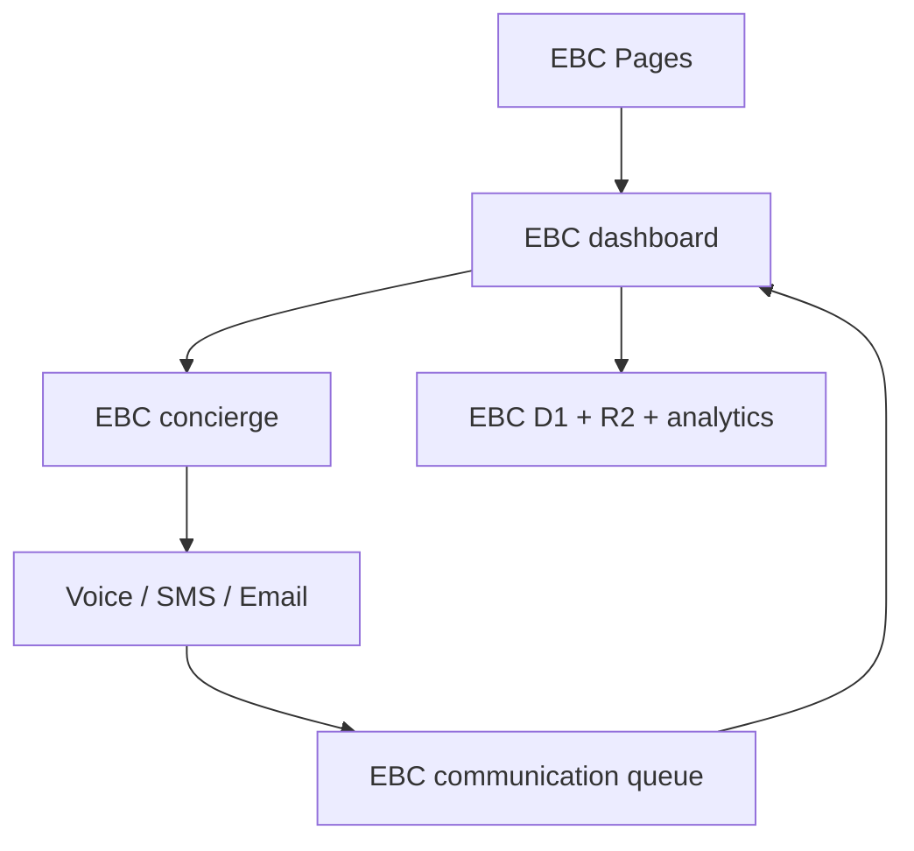

# Everything Built Custom Cloudflare tenant deployment

## Decision

Everything Built Custom is a dedicated production stack using the proven worker code, not a worker stack per shop or installer location. Because this repository belongs to Everything Built Custom, EBC resource names are the top-level Wrangler defaults. There is no production `blackhole-*` or `ace-*` target in its TOML files.

| Layer | EBC isolation | Shop/location model |
| --- | --- | --- |
| Dashboard | `ebc-dashboard-worker` | One corporate dashboard; filter by `locationId` |
| Orchestration | `ebc-concierge-worker` | Shared EBC workflows tagged by tenant/corporate/location |
| Channels | `ebc-voice-worker`, `ebc-sms-worker`, `ebc-email-worker` | Shared EBC channel capacity; no per-location worker copies |
| Transaction data | EBC-only dashboard and event D1 databases | Rows carry `tenantId`, `corporateId`, and `locationId` |
| Async work | EBC-only follow-up and communication queues | Messages carry the same scope fields |
| Archive | `ebc-call-center-archive` | Private prefixes under `tenants/ebc/` |
| Analytics | EBC-only Analytics Engine datasets | `tenantId` is the index; corporate/location are blobs |

This keeps the existing ACE and Black Hole workers and their data untouched and avoids deploying five workers for every shop. A separately operated business unit can later be promoted to its own repository or explicit Wrangler environment without changing the data contract.

## Deployment guardrail

`wrangler deploy` from this repository targets EBC workers only. Before any release, this command must return no matches:

```bash
grep -En 'name = "(blackhole|ace)-|service = "(blackhole|ace)-|queue = "(blackhole|ace)-|database_name = "(blackhole|ace)-' apps/*/wrangler.toml
```

The two D1 placeholders intentionally prevent a first production deployment until EBC databases have been created and their IDs copied into the TOMLs.

## Resource topology



Cloudflare Queues allow multiple producers but only one active consumer for a queue. The EBC communication queue therefore has its own dashboard consumer and must not reuse the Black Hole communication queue.

## Automated sidecar rollout

The repository now owns the complete first-deploy path. On the Black Hole host:

```bash
export EBC_WORKSPACE_ROOT=/mnt/eila-hot-sidecar/workspace/ebc
mkdir -p "$EBC_WORKSPACE_ROOT"
git clone https://github.com/blackholecapital/EBC.git "$EBC_WORKSPACE_ROOT/repo"
cd "$EBC_WORKSPACE_ROOT/repo"
bash scripts/server/bootstrap-sidecar.sh

export CLOUDFLARE_API_TOKEN='set-in-your-shell'
export CLOUDFLARE_ACCOUNT_ID='set-in-your-shell'

npm run cf:auth
npm run cf:provision
npm run cf:migrate
npm run cf:deploy
npm run cf:secrets
npm run cf:verify
```

The bootstrap script is `scripts/server/bootstrap-sidecar.sh`. If the repository
is already cloned, run it from the clone; it performs a fast-forward-only pull
and installs the pinned Wrangler and dashboard dependencies.

`cf:provision` is safe to rerun. It discovers or creates the two D1 databases,
R2 bucket, four queues, and Pages project; discovers both D1 UUIDs; writes the
ignored `.wrangler/ebc-resource-ids.env`; and renders the UUIDs into the local
Wrangler files. The UUIDs are account identifiers, not credentials.

## 1. Create the EBC resources manually

The automated command above is preferred. For troubleshooting, these are the
equivalent individual Wrangler commands:

```bash
npx wrangler d1 create ebc-call-center-dashboard
npx wrangler d1 create ebc-call-center-events
npx wrangler r2 bucket create ebc-call-center-archive

npx wrangler queues create ebc-followup-jobs
npx wrangler queues create ebc-followup-jobs-dlq
npx wrangler queues create ebc-communication-events
npx wrangler queues create ebc-communication-events-dlq
```

Export the two D1 IDs printed by Wrangler and render the configs:

```bash
export EBC_DASHBOARD_D1_ID='dashboard-d1-uuid'
export EBC_EVENTS_D1_ID='events-d1-uuid'
npm run cf:render
```

| Placeholder | Replace in |
| --- | --- |
| `REPLACE_WITH_EBC_DASHBOARD_D1_ID` | `apps/dashboard/wrangler.toml` |
| `REPLACE_WITH_EBC_EVENTS_D1_ID` | `apps/dashboard/wrangler.toml`, `apps/blackhole-concierge-worker/wrangler.toml` |

Analytics Engine datasets are declared in the Wrangler environments and are created/connected during deployment.

Initialize both databases with the tracked, idempotent schema:

```bash
npm run cf:migrate
```

## 2. Configure EBC secrets

Export the available values using `scripts/cloudflare/env.example` as the key
list, then run `npm run cf:secrets`. The script generates a shared
`INTERNAL_CALL_SECRET` when one is not supplied and installs the identical value
on dashboard, concierge, and voice. Provider values that are not exported are
reported and skipped.

| Worker | Secrets |
| --- | --- |
| Dashboard | `INTERNAL_CALL_SECRET`, Zoom credentials, LiveKit credentials |
| Concierge | `INTERNAL_CALL_SECRET`, DocuSign credentials |
| Voice | `INTERNAL_CALL_SECRET`, `TWILIO_ACCOUNT_SID`, `TWILIO_AUTH_TOKEN`, `TWILIO_PHONE_NUMBER`, `DEEPGRAM_API_KEY`, runtime token, optional `OPENAI_API_KEY` |
| SMS | `TWILIO_ACCOUNT_SID`, `TWILIO_AUTH_TOKEN`, `TWILIO_PHONE_NUMBER` |
| Email | `RESEND_API_KEY`, `FROM_EMAIL` |

Manual example:

```bash
npm run cf:auth
printf '%s' "$INTERNAL_CALL_SECRET" | scripts/cloudflare/wrangler.sh secret put INTERNAL_CALL_SECRET --config apps/voice-worker/wrangler.toml
```

Never place secret values in a TOML file or commit them to Git.

## 3. Deploy in dependency order

```bash
npm run cf:deploy
```

The EBC voice environment uses the authenticated public concierge URL rather than a service binding. This removes the voice/concierge circular deployment dependency. Concierge-to-voice and dashboard-to-concierge remain private service bindings.

## 4. Configure provider callbacks

- Twilio voice status and stream URLs: the `ebc-voice-worker` URLs from its TOML.
- Twilio SMS status URL: the `ebc-sms-worker` URL from its TOML.
- DocuSign return/connect URLs: the `ebc-concierge-worker` URL.
- Lead form API: the EBC Pages site `/api/leads` endpoint.

## 5. Validate the tenant boundary

```bash
npm run cf:verify
```

## 6. Enable GitHub-to-Cloudflare deployment

`.github/workflows/deploy-cloudflare.yml` validates and deploys the complete
stack on every relevant push to `main`, in dependency order. Configure this once
after the first `cf:provision` run:

```bash
source .wrangler/ebc-resource-ids.env

gh secret set CLOUDFLARE_API_TOKEN --repo blackholecapital/EBC
gh secret set CLOUDFLARE_ACCOUNT_ID --repo blackholecapital/EBC
gh variable set EBC_DASHBOARD_D1_ID --body "$EBC_DASHBOARD_D1_ID" --repo blackholecapital/EBC
gh variable set EBC_EVENTS_D1_ID --body "$EBC_EVENTS_D1_ID" --repo blackholecapital/EBC
gh variable set CLOUDFLARE_DEPLOY_ENABLED --body true --repo blackholecapital/EBC

gh workflow run deploy-cloudflare.yml --repo blackholecapital/EBC
```

The API token needs only the EBC deployment permissions: Workers Scripts,
Workers R2 Storage, D1, Queues, Pages, and Account Settings read. Keep provider
secrets in Cloudflare Worker secrets; do not copy them into GitHub unless a
future workflow must rotate them.

Health output should report `tenantId: ebc`. Dashboard API responses also return `X-Tenant-Id`, `X-Corporate-Id`, and `X-Location-Id` headers.

Confirm that:

1. An EBC lead appears only in the EBC D1 databases.
2. Communication events reach `ebc-communication-events`, not `blackhole-communication-events`.
3. Analytics writes land in the `ebc_*` datasets.
4. Event archives appear under `tenants/ebc/events/` and signed PDFs under `tenants/ebc/documents/`.
5. Existing Black Hole health checks and queue depth remain unchanged.

## Adding shops or installer locations

Do not copy Wrangler environments for ordinary EBC shops or installer locations. Create each location in the EBC tenant data with a stable ID such as `clearwater-shop`; send that ID as `X-Location-Id` or `locationId`. Corporate users query all locations, while shop users are restricted to their permitted IDs at the application authorization layer.

Create a new Wrangler environment only when a corporate tenant requires one or more of:

- contractual data isolation;
- dedicated provider credentials or phone numbers;
- independent release timing;
- materially different capacity or compliance controls.

For that case, add `[env.<tenant-slug>]` consistently to every worker, change every worker/resource name and URL, provision new D1/Queue/R2 resources, and keep the same tenant/corporate/location event contract. Environment bindings are explicit and must all be repeated; never rely on production bindings to inherit.

## Live-video note

The dashboard's existing Zoom/live-video API has been retained. Its provider credentials and callbacks must be configured as EBC-owned secrets before activation; do not route EBC customer sessions through ACE or Black Hole provider resources.
